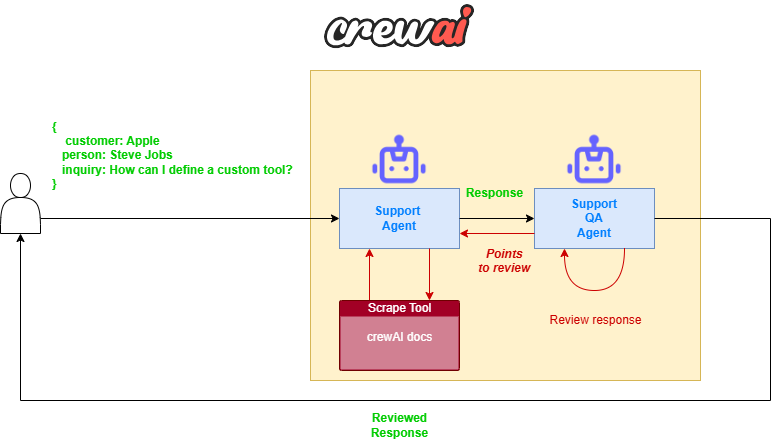

# crewai-basic-examples
Basic examples developed into Multi AI Agent Systems with crewAI Deeplearning Course

## Research and Writer Agents ([https://research-write-article-labs14.streamlit.app/](https://research-write-article-labs14.streamlit.app/))

In this example, we implement a basic Multi-Agent system to generate a blog post
about any topic given by the user. The system consists of three specialized AI agents
working together:

### 1. Content Planner Agent

Agent in charge of research the topic and creates a comprehensive content plan

### 2. Content Writer Agent
Creates the actual article based on the planner's outline.

### 3. Editor Agent
Reviews and refines the final content.

## Customer Support Agents ([https://customer-support-labs14.streamlit.app/](https://customer-support-labs14.streamlit.app/))

In this example, we implement a basic Multi-Agent system for customer support using two features:
* __Delegation__: An agent can delegate work to another agent.
* __Tools__: An agent can use a [predefined tool](https://docs.crewai.com/concepts/tools) or [build your custom tool](https://docs.crewai.com/how-to/create-custom-tools) to perform various actions.

The system consists of two specialized AI agents working together:

### 1. Support Agent

The agent is responsible for providing a complete response to customer requests based on data extracted from the [Creating a Crew and Kick It Off](https://docs.crewai.com/how-to/Creating-a-Crew-and-kick-it-off/) website using the [ScrapeWebsiteTool](https://docs.crewai.com/tools/scrapewebsitetool).

### 2. Support Quality Assurance Agent
This agent reviews the responses given by the Support Agent according to its guidelines. If the response provided by the **Support Agent** does not meet the expected quality, this agent will delegate the action back to the **Support Agent**.
