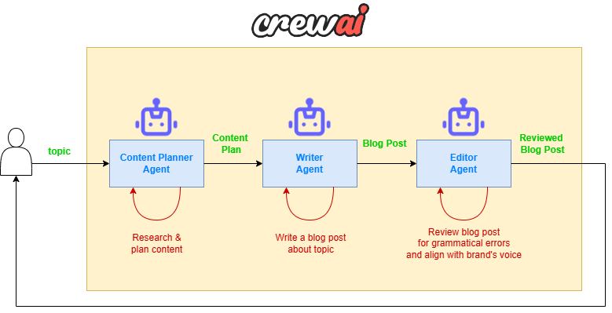

# crewai-basic-examples
Basic examples developed into Multi AI Agent Systems with crewAI Deeplearning Course

## Research and Writer Agents
Demo: [https://crewai-basic-examples-labs14.streamlit.app/](https://crewai-basic-examples-labs14.streamlit.app/)

Local Installation Instructions

To install and run this project locally, follow these steps:

1. Clone the repository: `git clone https://github.com/your-username/crewai-basic-examples.git`
2. Navigate to the project directory: `cd crewai-basic-examples`
3. Install the required packages: `pip install -r requirements.txt`
4. Set up your environment variables (e.g., GROQ_API_KEY, MODEL_NAME, MODEL_TEMPERATURE) in a new environment file: `.env`
5. Run the application: `python main.py`

In this example, we implement a basic Multi-Agent system to generate a blog post
about any topic given by the user. The system consists of three specialized AI agents
working together:

### 1. Content Planner Agent

Agent in charge of research the topic and creates a comprehensive content plan

### 2. Content Writer Agent
Creates the actual article based on the planner's outline.

### 3. Editor Agent
Reviews and refnes the final content.
